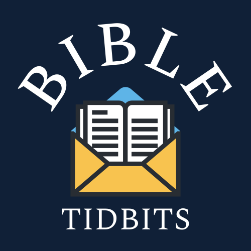

The Bible is deep, yet every truth within it has the power to transform lives. This is the heart behind Bible Tidbits. From short expositional podcasts that cut straight to the heart of the passage to engaging videos that help you dig deeper in your Bible study, Bible Tidbits exist to make scripture accessible without neglecting its depth.

Through Bible Tidbits, you can expect weekly podcasts and videos, alongside articles here on the website and faithful, inspiring content across all social media platforms. At each step, we are committed to the authority of scripture and to holding God’s Word high above everything else.

This ministry began as a simple devotional podcast I created each week for my youth group. But it quickly grew into more. As I prepared and recorded each episode, my passion for scripture only increased; I simply couldn’t get enough. Since then, I have continued serving in the same local church while also pursuing a Master of Divinity degree at The Southern Baptist Theological Seminary, with a certificate in Greek and Hebrew Exegesis.

What makes Bible Tidbits unique is the balance between scholarship and accessibility. While I have a deep love for the academic side of the Bible, I am equally passionate about making its teaching clear and practical. I know life is busy, but I believe this short, faithful content can open up the depth of God's word and help us all grow in our faith and knowledge.

So, I encourage you to explore this website and return to it often, as we will be adding resources regularly. Also, be sure to follow us on social media for even more ways to engage. And above all, remember the enduring truth of Isaiah 40:8 The grass withers, the flower fades, but the word of our God will stand forever

